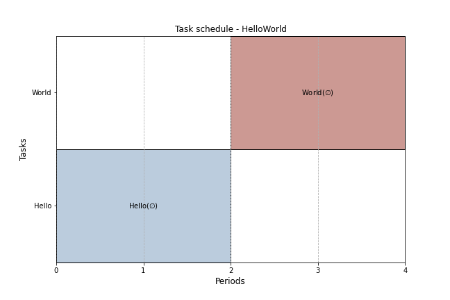

[](https://www.codacy.com/gh/tpaviot/ProcessScheduler/dashboard?utm_source=github.com&amp;utm_medium=referral&amp;utm_content=tpaviot/ProcessScheduler&amp;utm_campaign=Badge_Grade)
[](https://lgtm.com/projects/g/tpaviot/ProcessScheduler/context:python)
[](https://lgtm.com/projects/g/tpaviot/ProcessScheduler/alerts/)
[](https://codecov.io/gh/tpaviot/ProcessScheduler)
[](https://dev.azure.com/tpaviot/ProcessScheduler/_build?definitionId=9)
[](https://mybinder.org/v2/gh/tpaviot/ProcessScheduler/HEAD?filepath=examples-notebooks)
[](https://processscheduler.readthedocs.io/en/latest/?badge=latest)

# ProcessScheduler
A python library to compute resource-constrained task schedules.

## About
Computation is performed using the [Z3Prover](https://github.com/Z3Prover/z3).

## Helloworld

```python
import processscheduler as ps
# a simple problem, without horizon (solver will find it)
pb = ps.SchedulingProblem('HelloWorld')

# add two tasks
task_hello = ps.FixedDurationTask('Hello', duration=2)
task_world = ps.FixedDurationTask('World', duration=2)
pb.add_tasks([task_hello, task_world])

# precedence constraint: task_world must be scheduled
# after task_hello
c1 = ps.TaskPrecedence(task_hello, task_world, offset=0)
pb.add_constraint(c1)

# solve
solver = ps.SchedulingSolver(pb, verbosity=False)
solver.solve()

# displays solution, ascii or matplotlib gantt diagram
pb.print_solution()
pb.render_gantt_matplotlib()
```



## Features

-   tasks: ZeroDurationTask, FixedDurationTask, VariableDurationTask

-   resources: Worker, AlternativeWorkers

-   task constraints: TasksPrecedence, TasksStartSynced, TasksEndSynced, TaskStartAt, TaskEndAt, TaskStartAfterStrict, TaskStartAfterLax, TaskEndBeforeStrict, TaskEndBeforeLax

-   nested boolean operators between task constraints: not, or, xor, and

-   objectives: makespan, flowtime, earliest, latest

## Installation

ProcessScheduler has not any release yet. You have to download/test the development version from the git repository.

Fist create a local copy of this repository:
```bash
git clone https://github.com/tpaviot/ProcessScheduler
```
then install the development version:

```bash
cd ProcessScheduler
pip install ./src
```

## Jypter notebooks

There are some [Jupypter notebooks](https://github.com/tpaviot/ProcessScheduler/tree/master/example-notebooks). They can be executed online at [myBinder.org](https://mybinder.org/v2/gh/tpaviot/ProcessScheduler/HEAD?filepath=example-notebooks)

## Contibuting

The development started in december 2020, this is a release-early-work-in-progress. Feel free to submit :
-   new issues: questions, feature requests etc. Use our [issue tracker](https://github.com/tpaviot/ProcessScheduler/issues). Don't forget to assign the proper issue label, and describe the problem as precisely as possible by adding some python code to illustrate your question
-   new examples: submit a PR to add a notebook to the examples-notebooks suite
-   new tests: submit a PR to improve the number/type of current unittests
-   new code: submit a PR for fixing bugs, add new Task or Resource, opitmize function etc. Before submission, use pylint to remove trailing whitespaces, unused variables, unused imports

## License/Author

ProcessScheduler is distributed under the terms of the GNU General Public License v3 or (at your option) any later version. 
