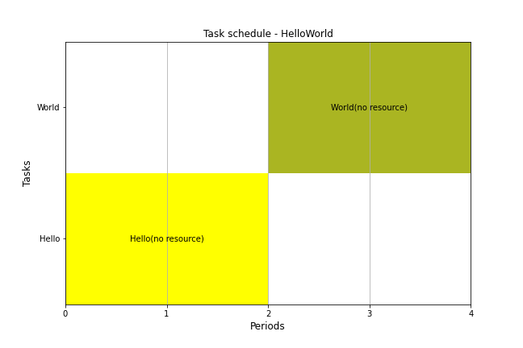

[](https://www.codacy.com/gh/tpaviot/ProcessScheduler/dashboard?utm_source=github.com&amp;utm_medium=referral&amp;utm_content=tpaviot/ProcessScheduler&amp;utm_campaign=Badge_Grade)
[](https://dev.azure.com/tpaviot/ProcessScheduler/_build?definitionId=9)
[](https://mybinder.org/v2/gh/tpaviot/ProcessScheduler/HEAD?filepath=examples-notebooks)

# ProcessScheduler
A python library to compute resource-constrained task schedules.

## About
Computation is performed using the [Z3Prover](https://github.com/Z3Prover/z3) SMT solver.

## Helloworld

```python
import processscheduler as ps
# a simple problem, without horizon (solver will find it)
pb = ps.SchedulingProblem('HelloWorld')

# add two tasks
task_hello = ps.FixedLengthTask('Hello', length=2)
task_world = ps.FixedLengthTask('World', length=2)
pb.add_tasks([task_hello, task_world])

# precedence constraint: task_wolrd must be scheduled
# after task_hello
c1 = ps.TaskPrecedence(task_hello, task_world, offset=0)
pb.add_constraint(c1)

# solve
solver = ps.SchedulingSolver(pb, verbosity=False)
solver.solve()

# displays solution, ascii or matplotlib gantt diagram
pb.print_solution()
pb.render_gantt_matplotlib()
```



## Features

-  tasks: ZeroLengthTask, FixedLengthTask, VariableLengthTask
-  resources: Worker
-  task constraints: TaskPrecedence, TaskStartSynced, TaskEndSynced, TaskStartAt, TaskEndAt
-  objectives: makespan, flowtime, earliest, latest

## Installation

ProcessScheduler has not any release yet.

Fist create a local copy of this repository:
```bash
git clone https://github.com/tpaviot/ProcessScheduler
```
then install the development version:

```bash
cd ProcessScheduler
pip install ./src
```

## Jypter notebooks

There are some [Jupypter notebooks](https://github.com/tpaviot/ProcessScheduler/tree/master/example-notebooks). They can be executed online at [myBinder.org](https://mybinder.org/v2/gh/tpaviot/ProcessScheduler/HEAD?filepath=example-notebooks)

## Contibuting

The development has started in december 2020, this is a release-early-work-in-progress. Feel free to submit issues or code.

## License

ProcessScheduler is distributed under the terms of the GNU General Public License v3 or (at your option) any later
version.
